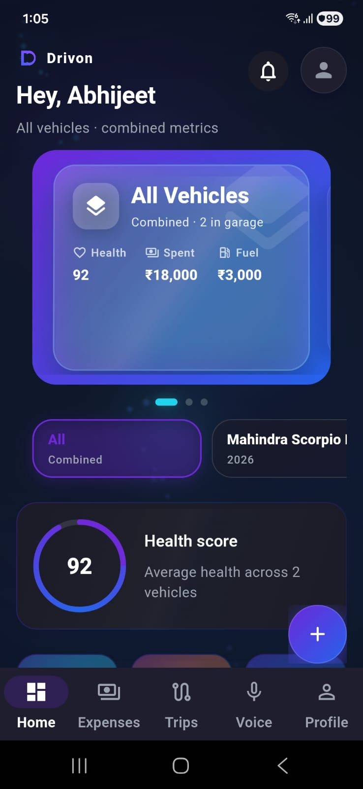
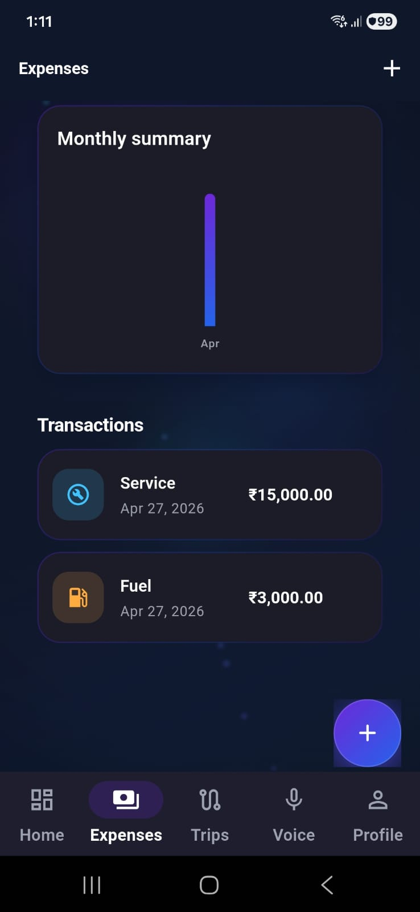

# 🚗 Drivon

> Premium vehicle management app with AI, analytics, and next-gen UX

---


## 📲 Download App

👉 Try Drivon on your device:
[⬇️ Download APK](https://github.com/abhijeetmaan/Drivon-app/releases/download/v1.0.0/app-release.apk)


*(Go to Releases → Download latest APK)*

👉 View all releases:  
https://github.com/abhijeetmaan/Drivon-app/releases

---

## ✨ Overview

Drivon is a modern, beautifully designed vehicle management app that helps you:

* Track expenses (fuel, service, insurance)
* Manage multiple vehicles
* Analyze monthly costs
* Use voice commands for quick actions
* Store important documents
* Get smart insights about your spending

---

## 🔥 Features

* 🚗 Multi-vehicle management
* 💸 Expense tracking with filters
* 📊 Smart analytics & insights
* 🎤 Voice assistant (add expense via voice)
* 📁 Document storage (insurance, PUC, etc.)
* 🔔 Service reminders
* 🎨 Premium UI (CRED-style design + animations)

---

## 🧠 Smart Insights

* Compare vehicle costs
* Monthly expense breakdown
* AI-based suggestions

---

## 🎬 App Preview

<p align="center">
  
  
  
</p>

---

## ⚙️ Tech Stack

* Flutter (UI)
* Dart
* Local Storage / Firebase (optional)
* Speech-to-Text API

---

## 🚀 Installation (For Developers)

```bash
git clone https://github.com/abhijeetmaan/Drivon-app.git
cd Drivon-app
flutter pub get
flutter run
```

---

## 🎯 Roadmap

* [ ] Cloud sync
* [ ] AI insights upgrade
* [ ] Dark/Light theme switch
* [ ] Advanced analytics dashboard

---

## 💼 Why This Project Stands Out

* Real-world use case (vehicle expense tracking)
* Clean architecture & scalable structure
* Premium UI with animations & micro-interactions
* Multi-feature integration (voice + analytics + storage)

---

## 👨‍💻 Author

**Abhijeet Maan**

---

## ⭐ Show your support

If you like this project, give it a ⭐ on GitHub!
